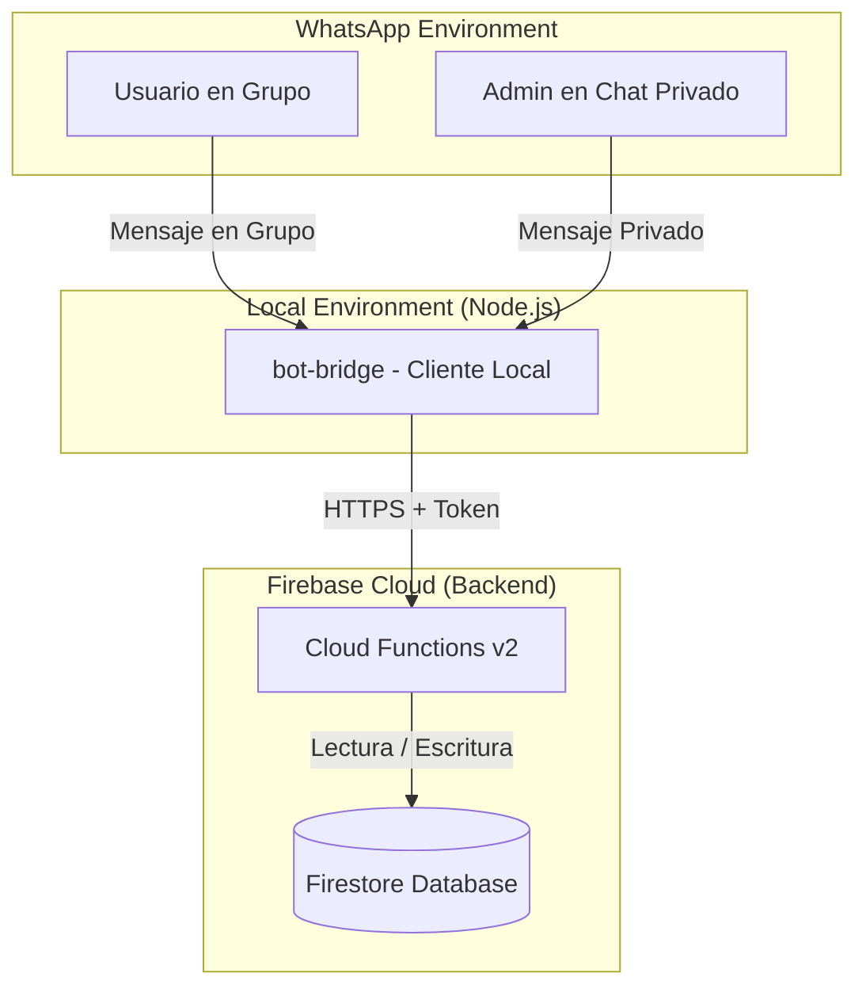

# 🏆 ExpertoMundial - Bot de Quinielas en WhatsApp

ExpertoMundial es un sistema interactivo de quinielas (pollas o pronósticos deportivos) que funciona directamente en **WhatsApp**. Los miembros de diferentes grupos pueden registrar sus predicciones de partidos, acumular puntos y competir en tablas de posiciones locales por grupo, gestionado por un administrador de forma centralizada a través de comandos privados.

El proyecto está diseñado bajo una arquitectura desacoplada: un **cliente ligero local (bot-bridge)** que interactúa con la API de WhatsApp, y un **backend robusto en la nube (Firebase Cloud Functions + Firestore)**.

---

## 🛠️ Especificaciones y Arquitectura Técnica

La arquitectura consta de dos partes principales que se comunican de forma segura mediante HTTPS con autenticación por token:



### 1. Cliente local (`bot-bridge`)
*   **Tecnologías:** Node.js, TypeScript, `whatsapp-web.js` (con motor Chromium Puppeteer).
*   **Sesión:** Persistencia de sesión local a través de `LocalAuth` (guardado en `.wwebjs_auth`).
*   **Parche de Compatibilidad:** Implementa cabeceras `User-Agent` de Chrome actualizado y descarga dinámica de caché (`webVersionCache`) para evitar el error de código QR/vinculación de WhatsApp Web.
*   **Sanitización de Datos:** Limpia automáticamente los sufijos de dispositivos múltiples de WhatsApp (ej: `:1@c.us` a `@c.us`) garantizando IDs de usuario uniformes e inequívocos en la base de datos.
*   **Control de Estado:** Motor de estados interactivos en memoria (`userStates`) con temporizador de expiración de 2 minutos para flujos conversacionales paso a paso (ej: registro de apodos).

### 2. Backend (`firebase`)
*   **Tecnologías:** Firebase Cloud Functions (v2, runtime Node.js 18+), Firestore, Firebase Admin SDK.
*   **Seguridad:** Endpoints públicos protegidos por token estático (`Authorization: Bearer <TOKEN>`) compartido entre el puente local y la nube.
*   **Base de datos (Firestore):**
    *   `/users/{userId}`: Datos globales del usuario (Nombre, Rol de administrador).
    *   `/matches/{matchId}`: Partidos del torneo (Equipos, fecha límite, estado y marcador oficial).
    *   `/predictions/{userId_matchId_groupId}`: Pronósticos individuales aislados por grupo de WhatsApp.
    *   `/groups/{groupId}/members/{userId}`: Tabla de posiciones aislada y rendimiento de cada usuario en el contexto de ese grupo.
*   **Manejo de Zona Horaria:** Todas las fechas y validaciones de límites de pronósticos se procesan utilizando el huso horario de **Quito/Ecuador (UTC-5 / America/Guayaquil)**, garantizando que el cierre de los pronósticos coincida de forma exacta con la hora del partido sin verse afectado por la hora UTC del servidor de Google.

---

## ⚙️ Variables de Entorno y Configuración

Tanto el bot-bridge como el backend requieren configuraciones específicas en sus archivos de entorno.

### En `bot-bridge/.env`:
```env
FIREBASE_FUNCTIONS_URL=https://<REGION>-<PROJECT_ID>.cloudfunctions.net
BOT_SECRET_TOKEN=tu_token_seguro_de_comunicacion

# Opcional: Ruta al ejecutable de Chromium (ej. /usr/bin/chromium-browser en Raspberry Pi)
# PUPPETEER_EXECUTABLE_PATH=/usr/bin/chromium-browser
```

### En el entorno de Firebase (Cloud Functions):
El token `BOT_SECRET_TOKEN` se despliega como variable de configuración.

> [!WARNING]
> **Seguridad:** Se han eliminado los tokens por defecto del código fuente. Es obligatorio definir la variable `BOT_SECRET_TOKEN` tanto en el `.env` del bot-bridge como en el `.env` de las Cloud Functions. Si no se configuran, el sistema denegará todas las peticiones con un error `401 Unauthorized` o el bot se detendrá en el arranque por seguridad.

---

## 👑 Manual del Administrador

El sistema cuenta con un mecanismo de **auto-registro de administrador**. En el primer inicio exitoso del bot, este tomará el número de teléfono de la cuenta vinculada y lo registrará automáticamente como el administrador global del sistema.

> [!IMPORTANT]
> **Canal de Comandos:** 
> - Los comandos de administración de configuración (como crear partidos y registrar resultados) se ejecutan exclusivamente en un **chat privado directo con el bot**. Si intentas usarlos en un grupo, el bot los rechazará.
> - Los comandos de autorización de canales (`!activargrupo` y `!desactivargrupo`) se ejecutan directamente **dentro del grupo de WhatsApp** que se desea activar o desactivar.

### Comandos de Administrador

#### 1. Crear un Partido
Registra un nuevo partido en el sistema indicando los equipos y el límite de tiempo de Quito para pronosticar. El ID del partido se autogenera de forma secuencial.
*   **Sintaxis:** `!crearpartido [EquipoA] vs [EquipoB] [YYYY-MM-DD HH:MM]`
*   **Ejemplo:**
    ```text
    !crearpartido Argentina vs Brasil 2026-06-15 15:00
    ```
*   **Respuesta del bot:**
    ```text
    📅 ¡Partido creado con éxito!
    👉 ID: 1
    ⚽ Argentina vs Brasil
    ⏰ Límite (Quito): 2026-06-15 15:00
    ```

#### 2. Cargar Resultado Oficial y Repartir Puntos
Una vez finalizado el partido real, el administrador registra el marcador final. Esto automáticamente calcula los puntos para todos los participantes que pronosticaron ese encuentro en todos los grupos y actualiza las tablas de posiciones.
*   **Sintaxis:** `!resultado [ID_PARTIDO] [GOLES_A]-[GOLES_B]`
*   **Ejemplo:**
    ```text
    !resultado 1 2-1
    ```
*   **Sistema de Puntuación:**
    *   **Acierto Exacto (Marcador exacto):** `3 puntos` (adicionalmente suma +1 a la cuenta de partidos exactos para desempates).
    *   **Acierto de Resultado (Ganador o empate, pero marcador diferente):** `1 punto`.
    *   **Fallo Total:** `0 puntos`.
*   **Respuesta del bot:** Muestra un desglose con los puntos acumulados por cada usuario en sus respectivos grupos.

#### 3. Activar un Grupo (Dentro del Grupo)
Autoriza al bot a operar y responder comandos dentro de este grupo de WhatsApp.
*   **Sintaxis:** `!activargrupo`
*   **Respuesta del bot:**
    ```text
    🔓 *GRUPO AUTORIZADO* 🔓
    ──────────────────
    Este grupo ha sido activado para jugar a *Experto Mundial*.
    ¡Que comience el juego! ⚽
    ```

#### 4. Desactivar un Grupo (Dentro del Grupo)
Desautoriza al bot dentro de este grupo de WhatsApp, haciendo que vuelva a estar completamente en silencio.
*   **Sintaxis:** `!desactivargrupo`
*   **Respuesta del bot:**
    ```text
    🔒 *GRUPO DESACTIVADO* 🔒
    ──────────────────
    El bot de *Experto Mundial* ha sido desactivado en este grupo y ya no responderá a los comandos.
    ```

---

## 👥 Manual del Usuario

Los usuarios comunes interactúan con el bot directamente desde los **grupos de WhatsApp** donde el bot esté presente, **siempre y cuando el grupo haya sido activado previamente** por el administrador.

> [!IMPORTANT]
> **Canal de Comandos:** Todos los comandos de juego, menús y pronósticos rápidos solo funcionan dentro de **chats grupales autorizados**. El bot ignorará peticiones de juego recibidas por chat privado.

### Formas de Interactuar

Los usuarios pueden interactuar de dos maneras:
1.  **Por letras rápidas:** Escribiendo únicamente la letra correspondiente a la opción (sin prefijo `!`).
2.  **Por comandos estructurados:** Utilizando el formato `![comando]`.

### El Menú Principal
Escribe la palabra **`menu`** (o `!menu`) en el grupo para recibir el panel de opciones:

```text
🏆 EXPERTO MUNDIAL - MENÚ PRINCIPAL 🏆
──────────────────
Por favor, escribe únicamente la letra de la opción que deseas realizar:

🇦 Ver partidos disponibles
🇧 Ver mis pronósticos
🇨 Ver la tabla de posiciones
🇩 Ver reglas del juego
🇪 Registrarme / Cambiar nickname
🇫 Ver resultados de partidos

──────────────────
Ejemplo: Escribe la letra A para ver los partidos. O usa comandos con ! (ej: !pronostico 1 2-1).
```

### Detalle de Opciones y Comandos

#### Opción A (o `!partidos`): Ver Partidos
Lista los partidos registrados que se encuentran en estado **pendiente** (disponibles para pronosticar), indicando su ID y la hora límite local para pronosticar.

#### Opción B (o `!mispronosticos`): Mis Pronósticos en el Grupo
Muestra los pronósticos que has enviado para el grupo actual, detallando los puntos que ganaste en cada uno si el partido ya concluyó.

#### Opción C (o `!ranking` / `!tabla`): Tabla de Posiciones
Devuelve el ranking del grupo actual. Muestra las posiciones ordenadas por puntos totales (descendente) y empates resueltos por cantidad de aciertos exactos (descendente).

#### Opción D (o `!reglas`): Reglas del Juego
Explica brevemente la distribución de puntos (3 puntos por marcador exacto, 1 punto por acertar ganador/empate, 0 por fallo).

#### Opción E (o `!registro`): Registrarse / Modificar Apodo
Inicia un flujo conversacional. El bot registrará tu nickname tras responder en un plazo de 2 minutos.
*   *Alternativa directa:* Puedes registrarte sin pasar por el flujo escribiendo `!registro [TuApodo]` (ej: `!registro ElDiego10`).

#### Opción F (o `!resultados`): Ver Resultados de Partidos
Muestra un resumen de los partidos que ya han finalizado o están jugándose, indicando los marcadores oficiales. Los resultados se ordenan con los más recientes primero.

---

## 🔮 Cómo Enviar Pronósticos Rápidos

Para hacer el juego fluido e intuitivo en chats grupales concurridos, los usuarios pueden enviar pronósticos directos **sin usar el prefijo `!`** de dos formas:

### 1. Pronóstico Individual
*   **Formato:** `[ID_PARTIDO]: [GOLES_LOCAL]-[GOLES_VISITANTE]`
*   **Ejemplo:**
    ```text
    1: 2-0
    ```

### 2. Múltiples Pronósticos en un solo mensaje
Puedes enviar varios pronósticos a la vez escribiendo uno por línea:
*   **Ejemplo:**
    ```text
    5: 0-3
    6: 1-2
    7: 0-3
    ```

> [!IMPORTANT]
> **Filtro de Seguridad:** El bot solo procesará mensajes en los que **todas las líneas no vacías** sean pronósticos válidos. Si incluyes saludos, comentarios o cualquier otro texto que no siga el formato `ID: Goles-Goles`, el bot ignorará el mensaje por completo para no interferir en el chat del grupo.

> [!TIP]
> *   Puedes modificar tus pronósticos las veces que quieras antes de que inicie cada partido.
> *   El sistema valida automáticamente que no puedas ingresar o modificar pronósticos después de la hora programada de inicio del encuentro correspondiente.

---

## 🚀 Despliegue Local del Puente

1. Entra a la carpeta del puente:
   ```bash
   cd bot-bridge
   ```
2. Instala dependencias y compila el proyecto:
   ```bash
   npm install
   npm run build
   ```
3. Ejecuta el bot en modo desarrollo o producción:
   ```bash
   npm run dev
   ```
4. Escanea el código QR que se dibuja en la consola desde la app móvil de WhatsApp (Dispositivos Vinculados).

---

## 🍓 Despliegue Técnico en Raspberry Pi 4 (Servidor Doméstico 24/7)

Esta sección sirve como memoria técnica para desplegar este bot (o bots similares basados en Puppeteer/Chromium) en una Raspberry Pi 4 (4GB RAM) corriendo de forma permanente en segundo plano.

### 1. Preparación del Sistema Operativo (Headless)
Se recomienda utilizar **Raspberry Pi OS Lite (64-bit)** (basado en Debian Bookworm) porque no consume recursos en interfaz gráfica (GUI), dejando toda la memoria y procesador libres para Puppeteer.

Durante el flasheo con *Raspberry Pi Imager*:
*   Habilitar **SSH** para control remoto.
*   Configurar credenciales de **Wi-Fi** locales.
*   Crear el usuario principal (ej: `pi` o `fo`).

### 2. Ajuste Crítico para Puppeteer en Arquitectura ARM (Procesador Raspberry)
Puppeteer descarga por defecto una versión de Chromium compilada para arquitecturas `x86/x64`. Para que funcione en el procesador ARM de la Raspberry Pi, se debe:

1.  Instalar el navegador Chromium nativo del sistema operativo:
    ```bash
    sudo apt update
    sudo apt install chromium-browser -y
    ```
2.  Consultar la ruta exacta de instalación de ese Chromium ejecutando `which chromium` o `which chromium-browser` (típicamente devuelve `/usr/bin/chromium` o `/usr/bin/chromium-browser`).
3.  Configurar la variable de entorno `PUPPETEER_EXECUTABLE_PATH` en el archivo `.env` del bot-bridge apuntando a esa ruta. El código la cargará dinámicamente:
    ```typescript
    executablePath: process.env.PUPPETEER_EXECUTABLE_PATH || undefined
    ```

### 3. Instalación de Node.js y Gestor de Procesos (PM2)
Para instalar Node.js 20 y asegurar que el bot se mantenga encendido indefinidamente y sobreviva a reinicios eléctricos:

```bash
# Instalar Node.js 20
curl -fsSL https://deb.nodesource.com/setup_20.x | sudo -E bash -
sudo apt install -y nodejs

# Instalar PM2 globalmente
sudo npm install -g pm2
```

### 4. Automatización del Arranque en el Sistema (systemd)
Para configurar PM2 como un servicio del sistema que se inicie al encender la Raspberry Pi:

1.  Ejecutar el comando de configuración:
    ```bash
    pm2 startup
    ```
2.  Copiar la línea de comando `sudo env PATH=...` que arroje la consola, pegarla y ejecutarla.
3.  Levantar el bot por primera vez:
    ```bash
    cd ExpertoMundial/bot-bridge
    pm2 start dist/index.js --name "quiniela-bot"
    ```
4.  **Guardar el estado actual:**
    ```bash
    pm2 save
    ```

#### ⚠️ Persistencia del Usuario en Consola Lite (Linger)
En servidores Linux sin escritorio (Lite), el sistema operativo apaga todos los procesos de tu usuario cuando cierras la sesión SSH. Para evitar que PM2 y el bot se apaguen al cerrar tu terminal en la PC, es obligatorio activar el *lingering* para el usuario de la Raspberry Pi:
```bash
sudo loginctl enable-linger fo
```

### 5. Control Remoto Global con Raspberry Pi Connect (Sin abrir puertos)
Para administrar y ver los logs del bot desde cualquier parte del mundo de forma segura mediante el navegador web, sin configurar VPN ni redireccionamiento de puertos en el router:

1.  Instalar la versión de terminal de Raspberry Pi Connect:
    ```bash
    sudo apt install rpi-connect-lite -y
    ```
2.  Iniciar sesión para vincular la cuenta de Raspberry Pi ID:
    ```bash
    rpi-connect signin
    ```
3.  Visitar el enlace único que dibuja la consola para autorizar el emparejamiento.
4.  Asegurar que el servicio corra de fondo:
    ```bash
    systemctl --user enable --now rpi-connect
    ```
